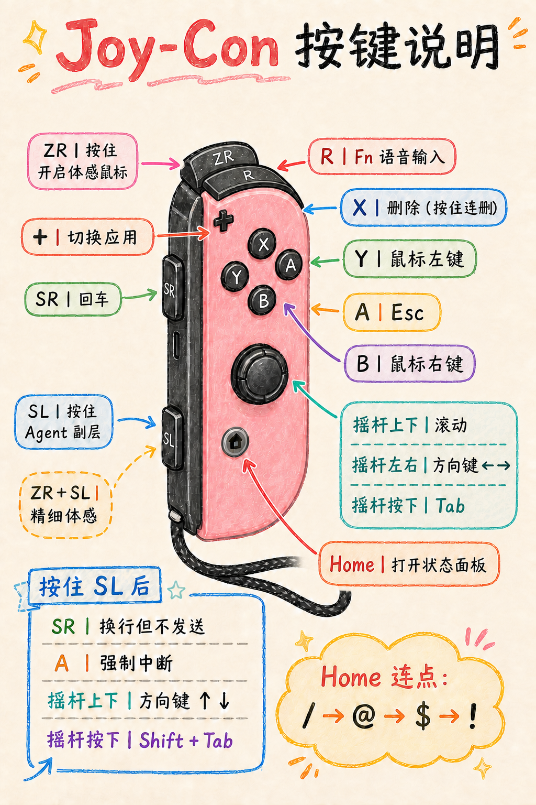

# JoyCon Vibe Remote

> 把 Nintendo Switch Joy-Con 变成 macOS 的体感鼠标与 Vibe Coding 遥控器。

JoyCon Vibe Remote 是一款常驻 macOS 菜单栏的轻量 App。它读取 Joy-Con 的
陀螺仪和加速度数据，让你通过手腕动作移动光标，同时把实体按键映射成鼠标、
键盘和 Agent 常用操作。

适合把电脑画面投到电视或墙面后，在沙发、演讲台等远离键盘的位置操作
Codex、Claude Code 和普通 macOS 应用。

> [!IMPORTANT]
> Joy-Con 本身不带麦克风。R 键可以触发 macOS 系统听写，但语音输入需要
> Mac 内置麦克风、有线麦克风或无线麦克风。

## 网页使用说明

[在线打开网页版说明书](https://hunduncn.github.io/joyconvibemouse/manual/) · [查看网页源码](docs/manual/index.html)

说明书包含：

- 蓝牙连接、权限授予和静置校准；
- 普通按键层、SL Agent 副层和 ZR 体感层；
- Vibe Coding 操作流程；
- 控制台设置与常见问题排查；
- 手机与桌面响应式布局，以及打印/PDF 样式。

克隆仓库后，直接用浏览器打开 `docs/manual/index.html` 即可离线阅读。

## 默认按键图



## 核心功能

- **体感鼠标：**按住 ZR 移动光标，松开立即停止；每次按下都会以当前握姿
  重新锚定方向。
- **精准体感：**按住 ZR + SL，以较低灵敏度瞄准小按钮和文本光标。
- **系统语音：**R 发送一次 Fn，可配合 macOS 的“单按 Fn 开启听写”。
- **鼠标与键盘：**支持左键、右键、回车、删除、Esc、Tab、方向键和应用切换。
- **Agent 副层：**按住 SL 后可换行但不发送、强制中断、反向切换焦点，并用
  摇杆操作真正的上下方向键。
- **命令符号：**按住 SL 连点 Home，依次输入 `/`、`@`、`$`、`!`。
- **按键自定义：**在菜单栏控制台中，分别设置每个按键的“单按”和“按住 SL 后”动作。

## 默认按键映射

| Joy-Con 操作 | 普通层 | 按住 SL 后 |
| --- | --- | --- |
| R | 单次 Fn（系统语音输入） | 同普通层 |
| SR | Return / Enter | Shift + Enter（换行但不发送） |
| A | Esc | Control + C（强制中断） |
| B | 鼠标右键 | 同普通层 |
| X | 删除；按住连续删除 | 同普通层 |
| Y | 鼠标左键；按住可拖动 | 同普通层 |
| + | Command + Tab（切换应用） | 同普通层 |
| Home | 打开状态面板 | 连点轮换 `/ → @ → $ → !` |
| 摇杆按下 | Tab | Shift + Tab |
| 摇杆上下 | 滚动 | 上、下方向键 |
| 摇杆左右 | 左、右方向键 | 左、右方向键 |
| ZR | 按住开启体感鼠标 | ZR + SL 为精准体感 |

ZR + SL 的精准体感组合优先于 SL Agent 副层，不会误触发副层按键动作。

## 系统要求

- macOS 14 或更高版本；
- 原版 Nintendo Switch Joy-Con (R)；
- 蓝牙连接；
- “辅助功能”权限；若系统阻止 HID 输入，再授予“输入监控”权限；
- 使用语音输入时，需要额外准备麦克风。

## 构建与安装

```bash
git clone https://github.com/hunduncn/joyconvibemouse.git
cd joyconvibemouse
./scripts/build-app.sh --install
open "/Applications/JoyCon Vibe Remote.app"
```

首次启动后：

1. 在 macOS「系统设置 → 蓝牙」中配对 `Joy-Con (R)`；
2. 按照提示授予 App“辅助功能”权限；
3. 连接成功后把 Joy-Con 静置约一秒，等待零点校准完成；
4. 按住 ZR，轻轻转动手腕开始控制光标。

构建脚本会生成并安装：

```text
/Applications/JoyCon Vibe Remote.app
```

## macOS 听写设置

R 键只负责向 macOS 发送一次 Fn，不会直接采集声音。要把它作为语音键，请在：

```text
系统设置 → 键盘 → 听写 → 快捷键
```

将听写方式设置为单按一次 Fn 可触发或关闭。不同 macOS 配置可能使用不同快捷键，
请以本机设置为准。

## 体感操作建议

- 把 ZR 当作鼠标的“离合器”：需要移动时按住，到达目标后松开；
- 按下 ZR 的瞬间保持手腕稳定，避免快速甩动；
- 改变握姿后，松开再重新按住 ZR，让系统重新锚定方向；
- 小幅抖动可以提高“稳定度”，横向移动不够快可以调整“水平倍率”；
- 调节参数时一次只改一项，更容易找到适合自己的手感。

## 项目结构

```text
Sources/JoyConVibeCore/       HID 数据、按键映射与体感算法
Sources/JoyConVibeRemote/     macOS 菜单栏 App 与系统事件输出
Tests/                        解析、映射、体感和界面回归测试
docs/manual/                  响应式网页版说明书
docs/assets/                  手绘按键图等文档素材
scripts/build-app.sh          Release 构建与安装脚本
```

## 开发与测试

```bash
DEVELOPER_DIR=/Applications/Xcode.app/Contents/Developer xcrun swift test
```

也可以在 Xcode 中直接打开 `Package.swift`。核心解析、体感算法和按键映射与
AppKit/SwiftUI 界面分离；自动化测试不会发送真实系统输入事件。

## 第三方声明

第三方代码与算法来源见 [THIRD_PARTY_NOTICES.md](THIRD_PARTY_NOTICES.md)。

Joy-Con 与 Nintendo Switch 是 Nintendo 的商标。本项目是独立开发工具，
与 Nintendo、OpenAI 或 Anthropic 无隶属或授权关系。
